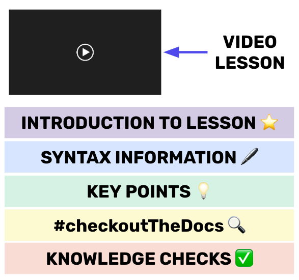
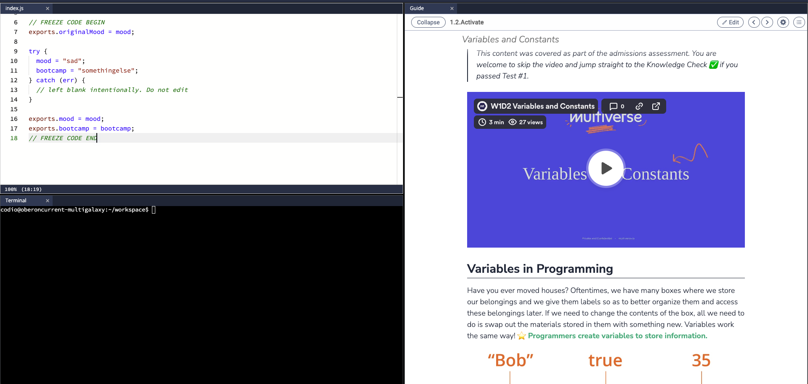

Learning to be a software engineer can be both exciting and scary (often at all the same time!). Below is some helpful information about the structure of lessons and how to get the most out of this learning experience.

*A representation of all the emotions you will feel as you develop your programming skills!*

## Helpful Icons

As you review the lessons in this Intro to Coding Course, you will see icons like the ones below, with helpful guidance or tips. You don't need to memorize these icons, but you should expect to see many of them throughout the lessons.

| Icon | Title | Description |
|----- |-------| ------------|
| 📝 |Directions| Whenever you see this icon, you are being given directions. Read carefully as many questions can be answered by reading these!|
| ⭐️ | Why This Is Important | You will see this icon whenever you are being given a reason why some concept is important to software engineers.|
| 🖊 | Code Syntax | Code must be written in a specific way. When you see this icon, you are being shown the structure for how to write a given block of code.|
| 💻 | Code Along | Many of the videos have examples in them. This icon indicates a spot to practice writing code with the video.|
| 🔍 | #checkoutTheDocs | Coding documentation are libraries of information that software engineers use to determine how to use certain commands/structures in their own programs. When you see this icon, you are being provided external resources that are ***optional*** to look at, but will be helpful during your career.|
| ✅ | Knowledge Check | Every lesson will end with Knowledge Checks. These are questions that will give you instant feedback as you progress through the content. If you’re stuck, go back to the videos and examples to help answer these! **You should answer every knowledge check.**|

There are two colors that will be used predominantly throughout the lessons:
- Words or sentences in **green** are key points about content.
- Words or phrases in **red** are essential vocabulary.

## Lesson Structure

Many of the lessons will follow a similar structure to the one shown below. As you pull out information, use this structure to identify different spots on the page to look for information and where to reference when you need to come back to this page.

## Coding Practice

During lessons, you will see many pages structured like this:

These pages are structured so that you can **PRACTICE** the coding skills as you learn them! Once you are finished with the Knowledge Check coding problem, you can submit your code and it will be graded for you!