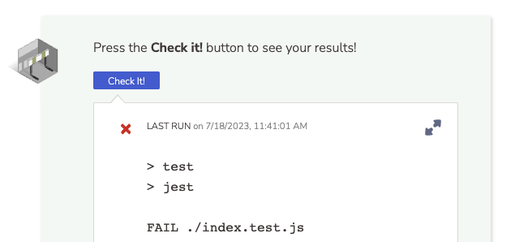
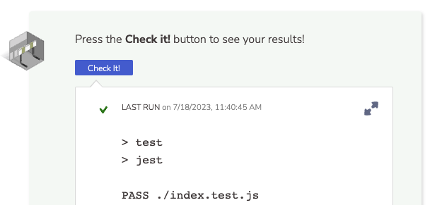

At Multiverse, we believe strongly in **Test Driven Development (TDD).** Through this course, there will be multiple code blocks for you to edit, running your code against the tests we have written.

## Knowledge Check ✅

Before you write any code, you can Check Answer to try it out.  So first:

1. Click "Check It!" at the end of the page (without fixing anything). This is the blue button at the bottom of this section.
2. **Note the tests that fail.** That’s OK!  There is no penalty for failing many times before passing a test.

3. **Now, fix the typo.** Can you spot it? Fix it, then click “Check Answer” again. You should receive results like this:

This is how much of our code will run. Writing code is fun, right?!

4. Run your code.
5. Grade your code!