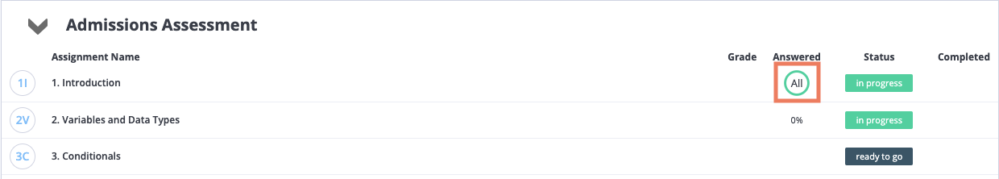
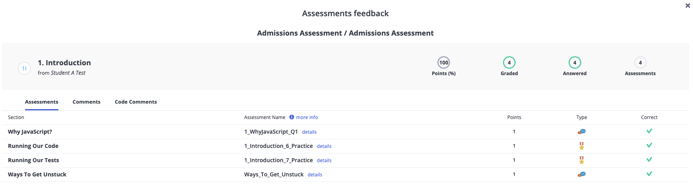

⭐️ **This course is designed to take about 15 hours for individuals that have never programmed before.** While this is a large time commitment, the content you learn in this course will be directly applicable to what you will learn in a Multiverse Bootcamp. Thus, taking the time now to learn these core programming skills will help to ensure your long term success!

## Monitoring Your Scores

⭐️ **In order to achieve a passing grade on this course, you should have a total score of 80% or above on EACH section.** Locating your score on Codio is a little tricky, but easy to find when you use the steps below!

1. Navigate to your dashboard for this course.
2. Click on "All" under the Answered column for the section that you want to know your score for.

3. A page will appear with your score for that section.

4. Make sure that you have scored at least an 80% on each section before moving on. Don't worry, you can re-do sections as many times as you want until you get the correct answer!

## Navigating Back to the Dashboard

Congratulations! You just finished the first section. To navigate to the next section, you can either: (1) press the "Return to Dashboard" button below or (2) the press Codio logo in the upper right corner. 

You should then continue to **2. Variables and Data Types** to start your coding journey. Good luck!